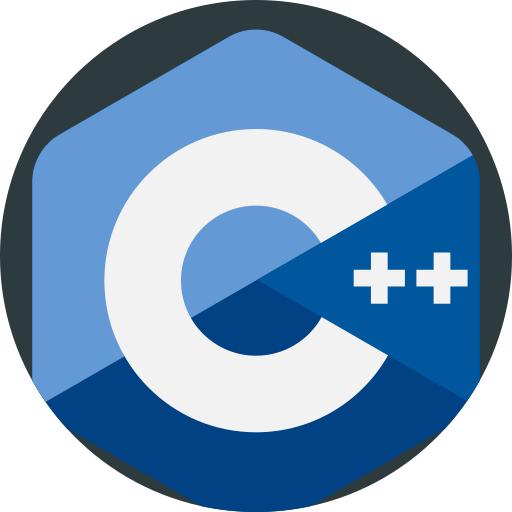
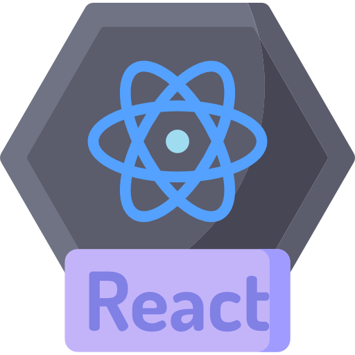
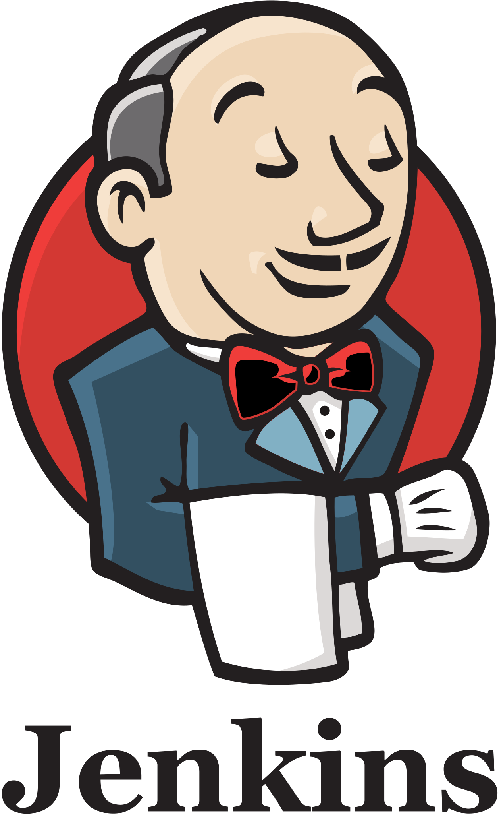
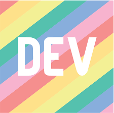

<h1 align="center">
  
  
  𝐇𝐞𝐥𝐥𝐨, 𝐟𝐞𝐥𝐥𝐨𝐰 <𝚍𝚎𝚟𝚎𝚕𝚘𝚙𝚎𝚛𝚜/>! 
</h1>

<h1 align="center">Hi , I'm Kulmeet Singh</h1>

<em>
 I am Kulmeet Singh, a final year CSE undergraduate at  <b>Graphic Era University</b>, Dehradun.  
    A budding <b>Full-Stack Web Developer</b>  a begineer in <b>Competitive Programming</b>&nbsp;&nbsp; and a <b>Cloud Enthusiast who is <b>obsessed</b>
    with the idea of <b>improving</b> himself and continuous learning
    &nbsp;
    &nbsp;
  </em>

&nbsp;***Talking about Personal Stuffs:***

-   🔭 I’m currently working on several projects (PS :- To know more keep visiting my github profile , I'll keep updating😜)
-   🌱 I’m currently learning stuff to be a Full-Stack Web Developer!
-   💬 AMA, I am happy to help!
-   📥 Drop your queries <a href="mailto:singhkulmeet3@gmail.com">here</a>.
-   😄 Pronouns: <b>He/Him</b>
-   ⚡ Fun fact: I like **Anime, sleeping, developing, problem solving, talking about cloud**. 
    

<h1 align="center">Tech-Stack</h1>

 
&nbsp;
&nbsp;
&nbsp;
  &nbsp;
  &nbsp;
  &nbsp;
  &nbsp;
  &nbsp;
  &nbsp;
  &nbsp;

<i><b>Tools used:</b></i> 
    
  &nbsp;
  &nbsp;
  &nbsp;
  &nbsp;
  &nbsp;
  &nbsp;
  &nbsp;
  &nbsp;
  &nbsp;
  &nbsp;
  &nbsp;
  &nbsp;
  &nbsp;
  &nbsp;

<h1 align="center">Coding Profiles</h1>

<a href="https://leetcode.com/Kulmeet/">
    &nbsp;
  </a>

  <a href="https://codeforces.com/profile/Kulmeet">
    &nbsp;
  </a>

  <a href="https://auth.geeksforgeeks.org/user/singhkulmeet3">
    &nbsp;
  </a>

<h1 align="center">Let's Get Connected</h1>

I am always open to collaborating on projects and innovative/disruptive ideas. Find out more about me & feel free to connect with me , and if you want help in any query then hit me up 😉

 <a href="mailto:singhkulmeet3@gmail.com">
    &nbsp;
  </a>
  <a href="https://www.linkedin.com/in/kulmeet-singh/">
    &nbsp;
  </a>
<a href="discordapp.com/users/755703876799299594">
    &nbsp;
  </a>
<a href="https://www.instagram.com/kul._.meet/">
    &nbsp;
  </a>
  <a href="https://ekka.me/kulmeet">
    &nbsp;
  </a>
  
 

 

  <i><b>GitHub Stats</b></i>  
  
    
  

  
 
 <b> You are visitor :</b> 
  

 
 
