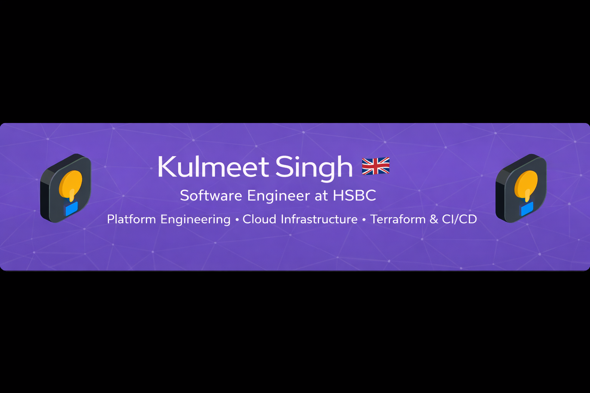
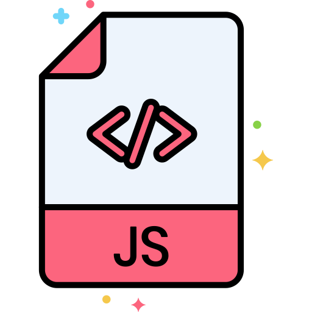
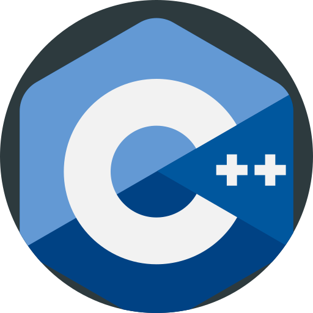
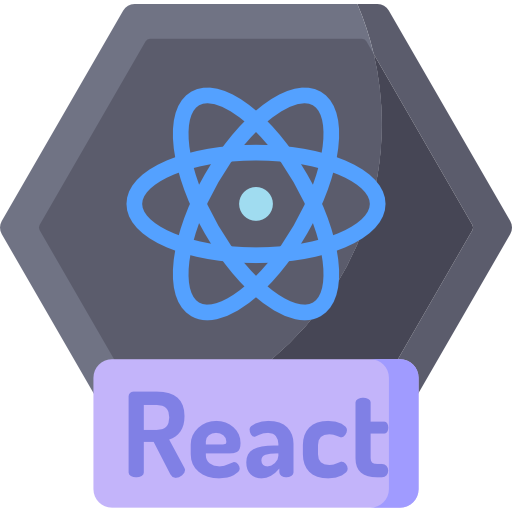
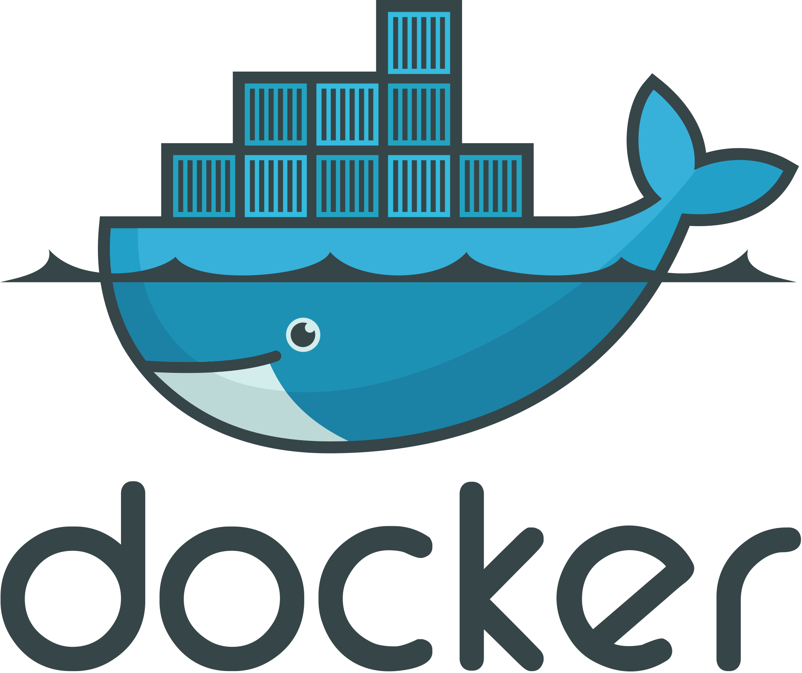

<h1 align="center">
  
</h1>

<h1 align="center">
  Hi , I'm Kulmeet Singh
</h1>

  <em>
    Software Engineer at <b>HSBC</b> | Backend, Cloud & Data Engineering
  </em>

  I build scalable backend systems, cloud-native data pipelines, and infrastructure automation.
   
  Currently working on real-time and batch data ingestion systems handling <b>1M+ records</b> using
  <b>Java, Apache Beam, Spring Boot, Shell Scripting, and Google Cloud Platform</b>.

---

##  About Me

- 💼 Software Engineer at **HSBC**
- ☁️ Certified **Google Cloud Professional Cloud Architect**
- ⚙️ Working on **real-time and batch data pipelines** on **GCP**
- 🧠 Interested in **Backend Engineering, Platform Engineering, Cloud Infrastructure, and Data Systems**
- 🛠️ Hands-on with **Jenkins, Terraform, CI/CD pipelines, and infrastructure automation**
- 🌱 Currently sharpening my expertise in **distributed systems, cloud architecture, and scalable backend design**
- 📫 Reach me at **[singhkulmeet3@gmail.com](mailto:singhkulmeet3@gmail.com)**

---

##  Tech Stack

### Languages & Frameworks

  &nbsp;
  &nbsp;
  &nbsp;
  &nbsp;
  &nbsp;
  &nbsp;
  &nbsp;
  &nbsp;

### Cloud, DevOps & Tools

  &nbsp;
  &nbsp;
  &nbsp;
  &nbsp;
  &nbsp;
  &nbsp;
  &nbsp;
  &nbsp;

### Areas I Work In

  Backend Engineering • Cloud Architecture • Data Pipelines • CI/CD • Infrastructure as Code • Automation

---

##  Certifications

- **Google Cloud Professional Cloud Architect**
- **Wipro Java Full Stack Certification**

---

##  What I’m Working On

- Building and improving **cloud-based ingestion pipelines**
- Exploring **platform engineering and infrastructure automation**
- Creating projects around **Terraform, CI/CD, and backend systems**
- Continuously improving my portfolio, GitHub, and technical depth

---

##  Coding Profiles

  <a href="https://leetcode.com/Kulmeet/">
    &nbsp;
  </a>
  <a href="https://codeforces.com/profile/Kulmeet">
    &nbsp;
  </a>
  <a href="https://auth.geeksforgeeks.org/user/singhkulmeet3">
    &nbsp;
  </a>

---

##  Let’s Connect

  I’m always open to connecting with people working in backend engineering, cloud, platform, and data systems.
   
  Feel free to reach out for collaboration, opportunities, or just a good tech conversation.

  <a href="mailto:singhkulmeet3@gmail.com">
    &nbsp;
  </a>
  <a href="https://www.linkedin.com/in/kulmeet-singh/">
    &nbsp;
  </a>
  <a href="https://discordapp.com/users/755703876799299594">
    &nbsp;
  </a>
  <a href="https://www.instagram.com/kul._.meet/">
    &nbsp;
  </a>

---

<!-- ## GitHub Stats

  

  <b>You are visitor:</b> 
  

 -->